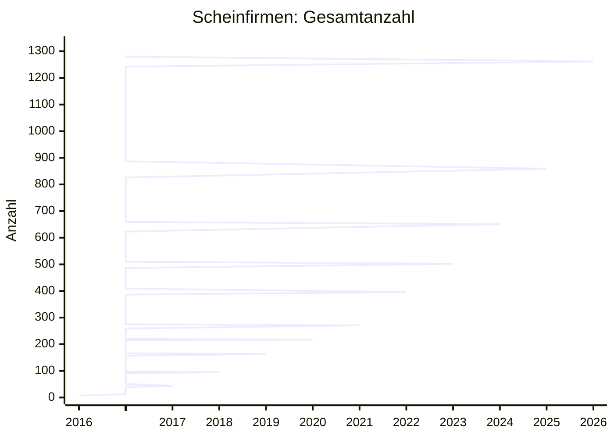

# Scheinfirmen Österreich — Statistik

> Stand: 2026-02-18T06:49:20 | Gesamt: 1280 | Erster Eintrag: 2016-04-01

## Verlauf

## Neueste Scheinfirmen (letzte 30 Tage)

| Name | UID | Anschrift |
|------|-----|-----------|
| AKARAPU Vinesh Reddy | ATU72312124 | 1220 Wien, Stadlbreiten 11 |
| Ahmet Bulduk GmbH | ATU15647405 | 1110 Wien, Am Kanal 27 |
| Auto MANS Logistik GmbH | ATU79780809 | 1030 Wien, Obere Viaduktgasse 26 |
| B.E.E.G. Baugesellschaft mbH | ATU81703934 | 1170 Wien, Lorenz-Bayer-Platz 18 |
| BB Kleintransport KG | ATU77209307 | 1200 Wien, Hellwagstraße 3 |
| BlackMoney GmbH | ATU78574749 | 1120 Wien, Hetzendorfer Straße 100 |
| CPI 5. Realwerte Verwaltungs GmbH | ATU67955126 | 1200 Wien, Wehlistraße 27B |
| DEMETER Monika Sara | ATU82203857 | 1200 Wien, Klosterneuburger Straße 28 |
| DUDAS Szimonetta |  | 1020 Wien, Körnergasse 5/10 |
| DUGMONICS Sandorne |  | 1200 Wien, Salzachstraße 1 |
| ESPACH Bau GmbH | ATU74641667 | 1150 Wien, Clementinengasse 6/4 |
| FN&Y GMBH | ATU80571917 | 1210 Wien, Hofherr-Schrantz-Gasse 2 |
| GASTRO EXPRESS KG |  | 1020 Wien, Rueppgasse 2/2.6 |
| GOMBOS Jozsef Karoly | ATU81976649 | 1220 Wien, Langobardenstraße 189 |
| Ikarus Transport GmbH | ATU81084229 | 1110 Wien, Simmeringer Hauptstraße 24 |
| Ilmaser GmbH | ATU80715567 | 7071 Rust, Am Seekanal 8 |
| Kurma GetränkehandelsgesmbH | ATU82117308 | 1110 Wien, Simmeringer Hauptstraße 43 |
| PUSKA Boris | ATU81904478 | 1200 Wien, Allerheiligenplatz 3 |
| SMEJKAL Libor | ATU82169458 | 1190 Wien, Barawitzkagasse 21/3 |
| Sebusavac Handels GmbH | ATU76775036 | 1230 WienWien, Levasseurgasse 3 |
| Talocci M. e.U. | ATU82520069 | 1190 Wien, Hackhofergasse 1 |
| VLM Aurora Immoinvest GmbH | ATU79056879 | 1120 Wien, Schönbrunner Straße 238 |
| Wegscheid 4 Dienstleistung GmbH | ATU74849505 | 1200 Wien, Wehlistraße 27B |
| YORDANOV Yordan Yordanov |  | 1150 Wien, Diefenbachgasse 40 |
| ZM Conbau GmbH | ATU77697912 | 1100 Wien, Alxingergasse 105 |
| ÖST Projekt GmbH | ATU80233445 | 1120 Wien, Krichbaumgasse 8 |

*26 Einträge hinzugefügt.*
