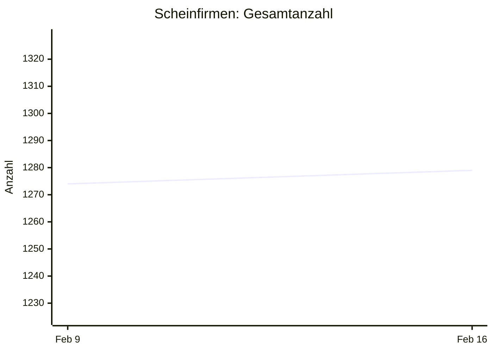

# Scheinfirmen Österreich — Statistik

> Stand: 2026-02-18T06:49:20 | Gesamt: 1280 | Tracking seit: 2026-02-10

## Neueste Scheinfirmen (letzte 30 Tage)

| Name | UID | Anschrift |
|------|-----|-----------|
| Ahmet Bulduk GmbH | ATU15647405 | 1110 Wien, Am Kanal 27 |
| BB Kleintransport KG | ATU77209307 | 1200 Wien, Hellwagstraße 3 |
| DEMETER Monika Sara | ATU82203857 | 1200 Wien, Klosterneuburger Straße 28 |
| DUDAS Szimonetta |  | 1020 Wien, Körnergasse 5/10 |
| DUGMONICS Sandorne |  | 1200 Wien, Salzachstraße 1 |
| SMEJKAL Libor | ATU82169458 | 1190 Wien, Barawitzkagasse 21/3 |
| Sebusavac Handels GmbH | ATU76775036 | 1230 WienWien, Levasseurgasse 3 |
| Talocci M. e.U. | ATU82520069 | 1190 Wien, Hackhofergasse 1 |
| ZM Conbau GmbH | ATU77697912 | 1100 Wien, Alxingergasse 105 |

*9 Einträge hinzugefügt.*

## Wöchentliche Änderungen

| Woche | Datum | Zugänge | Abgänge | Gesamt |
|-------|-------|---------|---------|--------|
| 2026-W07 | Feb 9 | *1274 (initial)* | — | 1274 |
| 2026-W08 | Feb 16 | +5 | 0 | 1279 |

## Verlauf

