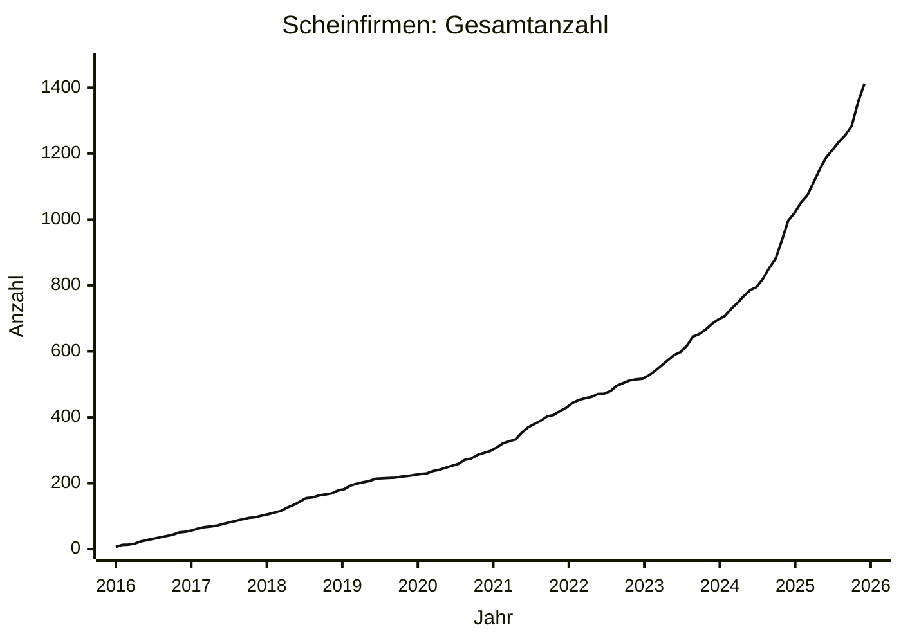

# Scheinfirmen Österreich — Statistik

| Stand | Gesamt | Erster Eintrag |
|-------|-------:|----------------|
| 2026-05-09T07:29:15 | 1423 | 2016-04-01 |

## Verlauf

```mermaid
---
config:
  themeVariables:
    xyChart:
      plotColorPalette: "#111111"
---
xychart-beta
    title "Scheinfirmen: Gesamtanzahl"
    x-axis "Jahr" 2016 --> 2026
    y-axis "Anzahl" 0 --> 1473
    line [7, 13, 14, 17, 24, 28, 32, 36, 40, 44, 51, 53, 57, 63, 67, 69, 72, 77, 82, 86, 91, 95, 97, 102, 106, 111, 116, 126, 134, 144, 155, 157, 163, 166, 169, 178, 182, 193, 199, 203, 207, 214, 215, 216, 217, 220, 222, 225, 228, 230, 237, 241, 247, 253, 259, 271, 275, 286, 292, 298, 308, 321, 327, 333, 354, 370, 380, 390, 403, 407, 419, 429, 444, 453, 458, 462, 471, 472, 480, 496, 504, 512, 515, 517, 527, 541, 557, 573, 589, 598, 617, 645, 653, 667, 684, 697, 707, 729, 747, 768, 786, 795, 820, 853, 881, 937, 997, 1020, 1051, 1073, 1113, 1154, 1189, 1212, 1236, 1256, 1284, 1356, 1412, 1423]
```

## Neueste Scheinfirmen (letzte 30 Tage)

| Name | UID | Anschrift |
|------|-----|-----------|
| AEGIS e.U. | ATU81120939 | 2272 Ringelsdorf-Niederabsdorf, Palterndorfer Straße 248 |
| ARTED GmbH | ATU15328009 | 1100 Wien, Gudrunstraße 25 |
| AS Asenov Bau KG | ATU78447717 | 1210 Wien, Brünner Straße 124 |
| AS-GV GmbH | ATU80027659 | 1010 Wien, Sterngasse 3 |
| BABKO Dienstleistungs GmbH | ATU67920609 | 1010 Wien, Sterngasse 2/3/6 |
| BALOGOVA Alzbeta | ATU81239027 | 1160 Wien, Lambertgasse 15 |
| BARTOS Marek | ATU82334519 | 1200 Wien, Traunfelsgasse 5 |
| BUKOVA Valeria | ATU81668517 | 1190 Wien, Heiligenstädter Straße 30 |
| Baumaschinen Bauroos GmbH | ATU77248836 | 1040 Wien, Kettenbrückengasse 6 |
| CERVENKA Mario | ATU82528702 | 1190 Wien, Wigandgasse 37 |
| CINA Miroslav |  | 1200 Wien, Allerheiligenplatz 3/10 |
| DANIEL David | ATU81882615 | 1170 Wien, Blumengasse 49 |
| DAVID Renato | ATU81779602 | 1100 Wien, Humboldtgasse 25 |
| Debo Zwölf Immobilien GmbH | ATU74093214 | 1010 Wien, Seitenstettengasse 5/37 |
| DÖMÖTÖR Joszef | ATU82541545 | 1100 Wien, Keplergasse 3 |
| Elektro Blitz ic e.U. | ATU82356567 | 1120 Wien, Albrechtsbergergasse 12 |
| Emto Bau GmbH | ATU79597358 | 1140 Wien, Ameisgasse 63/1/2 |
| GUJJAR GUJJAR Javed | ATU82056418 | 1100 Wien, Inzersdorfer Straße 61 |
| HORVATH Krisztian | ATU81812647 | 1100 Wien, Quellenstraße 77 |
| HORVATH Zsolt Andras | ATU82537113 | 1100 Wien, Herzgasse 80 |
| HYGIENIA cleaning gmbh | ATU78677647 | 1120 Wien, Schönbrunner Straße 213-215 |
| IPH Handels GmbH | ATU82573528 | 1050 Wien, Spengergasse 52/8 |
| IQBAL ZAFAR Muhammad Zohaib | ATU82077217 | 1100 Wien, Inzersdorfer Straße 97/33 |
| IVANOV Manuil Georgiev | ATU81613489 | 1200 Wien, Brigittenauer Lände 58 |
| JURO Bau und Eisenverlegung GmbH | ATU77519106 | 1140 Wien, Märzstraße 126/18 |
| KLIMENT Rudolf | ATU82528347 | 1110 Wien, Geiselbergstraße 28/1/58 |
| KOLAR Vanessa | ATU82541215 | 1110 Wien, Zippererstraße 14 |
| LAKATOSOVA Nina |  | 1050 Wien, Zentagasse 5 |
| LESNIEWSKI Grzegorz Stanislaw |  | 1120 Wien, Bischoffgasse 13/9 |
| MALIK Peter | ATU82441804 | 1200 Wien, Jägerstraße 21 |
| MATA Sandor |  | 1100 Wien, Inzersdorfer Straße 29/19 |
| Miletic Bau & Isolierungen GmbH | ATU58111019 | 2353 Guntramsdorf, Industriestraße 41 |
| OLAH Jan | ATU82464628 | 1100 Wien, Humboldtgasse 38 |
| PISTOVA Monika |  | 1220 Wien, Eva-Maria-Mazzucco-Platz 1 |
| PLSICIK Peter | ATU81471079 | 1200 Wien, Klosterneuburger Straße 28 |
| POLJANSZKIJ Sandor | ATU82346613 | 1050 Wien, Reinprechtsdorfer Straße 14 |
| PRO-ODIM Immo & Trade GmbH | ATU73864026 | 1140 Wien, Hauptstraße 133/1/4a |
| Princ Handels GmbH | ATU81079208 | 1180 Wien, Martinstraße 10 |
| Profi PV-Anlagen GmbH | ATU79933306 | 1020 Wien, Robertgasse 1 |
| RADENKOVIC Susanna | ATU80079727 | 1160 Wien, Ottakringer Straße 154 |
| RAVASZNE VARGA Krisztina | ATU81755637 | 1100 Wien, Columbusgasse 96 |
| ROLY Bau GmbH | ATU75124107 | 2320 Schwechat, Mautner Markhof-Straße 1 |
| Red4Tech GmbH | ATU81480078 | 2272 Ringelsdorf-Niederabsdorf, Palterndorfer Straße 248 |
| SIMEONOV Yanko | ATU82640439 | 1150 Wien, Hütteldorfer Straße 48/22 |
| SIPOS Roman | ATU82665705 | 1120 Wien, Siebertgasse 6/22 |
| Savacium GmbH | ATU76488267 | 1150 Wien, Gablenzgasse 7/DG/17 |
| Surek GmbH | ATU80105967 | 1020 Wien, Vereinsgasse 16/29 |
| TAMAS Mario | ATU81909268 | 1210 Wien, Koloniestraße 31 |
| TANACKOVIC Svetlana | ATU82394712 | 1030 Wien, Würtzlerstraße 26 |
| Todorovic & Kerculy OEG |  | 1200 Wien, Spittelbreitengasse 30/18 |
| VAGVOLGYI Tamas | ATU82102029 | 1100 Wien, Absberggasse 45A |
| Wikri Alpha Projektmanagement Gesellschaft m.b.H. |  | 1060 Wien, Eisvogelgasse 6 |