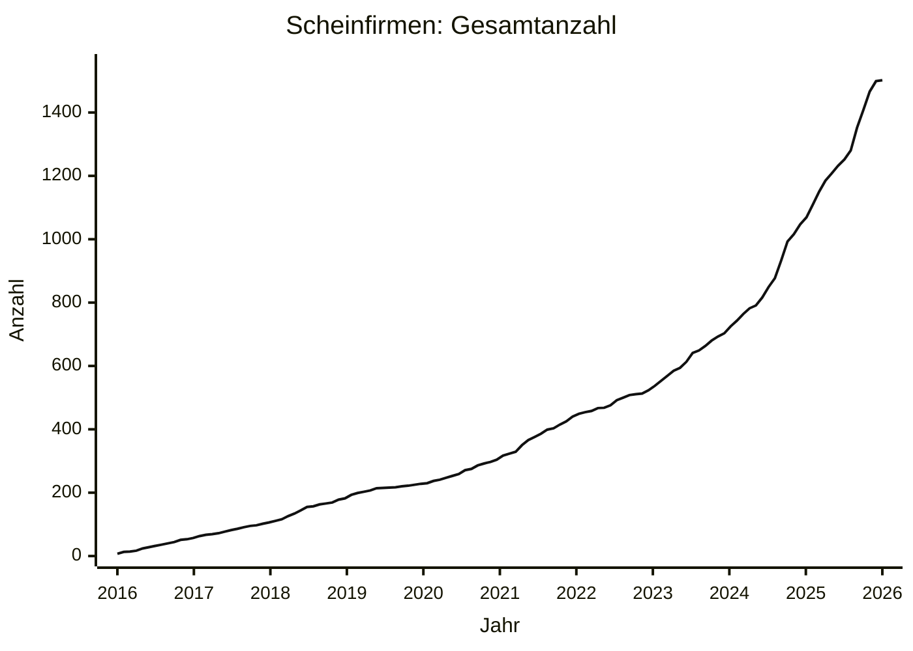

# Scheinfirmen Österreich — Statistik

| Stand | Gesamt | Erster Eintrag |
|-------|-------:|----------------|
| 2026-07-02T08:08:31 | 1502 | 2016-04-01 |

## Verlauf

```mermaid
---
config:
  themeVariables:
    xyChart:
      plotColorPalette: "#111111"
---
xychart-beta
    title "Scheinfirmen: Gesamtanzahl"
    x-axis "Jahr" 2016 --> 2026
    y-axis "Anzahl" 0 --> 1552
    line [7, 13, 14, 17, 24, 28, 32, 36, 40, 44, 51, 53, 57, 63, 67, 69, 72, 77, 82, 86, 91, 95, 97, 102, 106, 111, 116, 126, 134, 144, 155, 157, 163, 166, 169, 178, 182, 193, 199, 203, 207, 214, 215, 216, 217, 220, 222, 225, 228, 230, 237, 241, 247, 253, 259, 271, 275, 286, 292, 297, 304, 317, 323, 329, 350, 366, 376, 386, 399, 403, 415, 425, 440, 449, 454, 458, 467, 468, 476, 492, 500, 508, 511, 513, 523, 537, 553, 569, 585, 594, 613, 641, 649, 663, 680, 693, 703, 725, 743, 764, 782, 791, 816, 849, 877, 933, 993, 1016, 1047, 1069, 1109, 1150, 1185, 1208, 1232, 1252, 1280, 1352, 1408, 1466, 1499, 1502]
```

## Neueste Scheinfirmen (letzte 30 Tage)

| Name | UID | Anschrift |
|------|-----|-----------|
| A.D.M.K. GmbH | ATU76562346 | 1230 Wien, Birostraße 11/6 |
| ANUMASU Karunaker Reddy | ATU80861319 | 1230 Wien, Perfektastraße 18 |
| ASENOV Asen Iliev |  | 1210 Wien, Brünner Straße 124/53 |
| AVGR Haustechnik GmbH | ATU66259158 | 1210 Wien, Ohmgasse 4 |
| Amir construct KG | ATU80674227 | 1200 Wien, Donaueschingenstraße 21/8 |
| Bellak Handels GmbH |  | 1200 Wien, Hartlgasse 20 |
| Berno Bau GmbH | ATU76130848 | 1220 Wien, Hirschstettner Straße 19 |
| DJORDJEVIC | ATU80754836 | 1230 Wien, Breitenfurter Straße 320//1/111 |
| DUSKA Michal | ATU79291035 | 1100 Wien, Puchsbaumgasse 37 |
| DUSKOVA Maria | ATU79278014 | 1100 Wien, Puchsbaumgasse 37 |
| EPURE Iustin-Sebastian | ATU80788701 | 1120 Wien, Rauchgasse 23 |
| ERTEKIN Hasan | ATU82570727 | 2333 Leopoldsdorf, Oberlaaerstraße 55 |
| FICZERE Jenö | ATU77530539 | 7464 Markt Neuhodis, Graben 17 |
| Firoza Bau GmbH | ATU81976319 | 1210 Wien, Hofherr-Schrantz-Gasse 2 |
| KIROV Zhelyazko Ankov |  | 1050 Wien, Straußengasse 3/9 |
| KOLOMPAR Rezi | ATU82049418 | 1110 Wien, Sedlitzkygasse 14 |
| M. TRANS SERVICE Kleintransport GmbH | ATU80370439 | 1180 Wien, Weinhauser Gasse 5 |
| MK Interio GmbH | ATU74354502 | 1220 Wien, Rautenweg 22 |
| Mirkovic Reinigung e.U. | ATU74819235 | 1100 Wien, Sickingengasse 13 |
| Molakom GmbH in Abwicklung | ATU81342726 | 1020 Wien, Franzensbrückenstraße 14 |
| NEMETH Sandor | ATU81491609 | 2201 Hagenbrunn, Sechste Gasse 2 |
| PBS Professional Business Services e.U | ATU67459911 | 1220 Wien, Gisela-Legath-Gasse 5 |
| PETRAS Geza | ATU73620548 | 4030 Linz, Matthäus-Herzog-Straße 3/4.ST.39 |
| POMPOVA Zdenka |  | 1120 Wien, Siebertgasse 6 |
| POPOFF György | ATU56983955 | 1210 Wien, Brünner Straße 213/236 |
| Roommaster Roommaker GmbH | ATU65836768 | 1230 Wien, Tenschertstraße 5 |
| SAMU Teli |  | 1020 Wien, Volkertstraße 14/9 |
| SINGH Harsimren | ATU79386335 | 1100 Wien, Senefeldergasse 77 |
| SIPOSOVA Natalia |  | 1120 Wien, Siebertgasse 6 |
| SUNDARAGIRI Shankar | ATU80078719 | 1120 Wien, Tichtelgasse 21 |
| Stanic G4 GmbH | ATU57998803 | 1120 Wien, Spießhammergasse 4/1 |
| ZAMBO Szabolcs-Dinu |  | 4484 Kronstorf, Hauptstraße 48 |