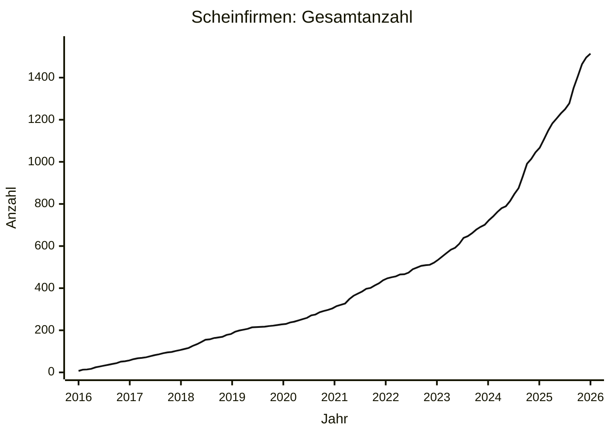

# Scheinfirmen Österreich — Statistik

| Stand | Gesamt | Erster Eintrag |
|-------|-------:|----------------|
| 2026-07-15T07:08:47 | 1514 | 2016-04-01 |

## Verlauf

```mermaid
---
config:
  themeVariables:
    xyChart:
      plotColorPalette: "#111111"
---
xychart-beta
    title "Scheinfirmen: Gesamtanzahl"
    x-axis "Jahr" 2016 --> 2026
    y-axis "Anzahl" 0 --> 1564
    line [7, 13, 14, 17, 24, 28, 32, 36, 40, 44, 51, 53, 57, 63, 67, 69, 72, 77, 82, 86, 91, 95, 97, 102, 106, 111, 116, 126, 134, 144, 155, 157, 163, 166, 169, 178, 182, 193, 199, 203, 207, 214, 215, 216, 217, 220, 222, 225, 228, 230, 237, 241, 247, 253, 259, 271, 275, 286, 292, 297, 304, 315, 321, 327, 348, 364, 374, 384, 397, 401, 413, 423, 438, 447, 452, 456, 465, 466, 474, 490, 498, 506, 509, 511, 521, 535, 551, 567, 583, 592, 611, 639, 647, 661, 678, 691, 701, 723, 741, 762, 780, 789, 814, 847, 875, 931, 991, 1014, 1045, 1067, 1107, 1148, 1183, 1206, 1230, 1250, 1278, 1350, 1406, 1464, 1496, 1514]
```

## Neueste Scheinfirmen (letzte 30 Tage)

| Name | UID | Anschrift |
|------|-----|-----------|
| A.D.M.K. GmbH | ATU76562346 | 1230 Wien, Birostraße 11/6 |
| ANUMASU Karunaker Reddy | ATU80861319 | 1230 Wien, Perfektastraße 18 |
| ASENOV Asen Iliev |  | 1210 Wien, Brünner Straße 124/53 |
| AVGR Haustechnik GmbH | ATU66259158 | 1210 Wien, Ohmgasse 4 |
| AXI Trade GmbH | ATU59072309 | 1010 Wien, Sterngasse 3 |
| Amir construct KG | ATU80674227 | 1200 Wien, Donaueschingenstraße 21/8 |
| BADDAM Devender Reddy | ATU81244903 | 1230 Wien, Perfektastraße 18 |
| BALOGH Zsofia Panka | ATU82820226 | 1100 Wien, Quellenstraße 77 |
| BIRNEATA Robert |  | 6890 Lustenau, Augartenstraße 20 |
| Berno Bau GmbH | ATU76130848 | 1220 Wien, Hirschstettner Straße 19 |
| CINOVA Katarina |  | 5020 Salzburg, Gebirgsjägerplatz 1 |
| DUSKA Michal | ATU79291035 | 1100 Wien, Puchsbaumgasse 37 |
| DUSKOVA Maria | ATU79278014 | 1100 Wien, Puchsbaumgasse 37 |
| ERTEKIN Hasan | ATU82570727 | 2333 Leopoldsdorf, Oberlaaerstraße 55 |
| Firoza Bau GmbH | ATU81976319 | 1210 Wien, Hofherr-Schrantz-Gasse 2 |
| GOFF Handel GmbH | ATU77486436 | 4600 Wels, Dragonerstraße 46/5 |
| Glamour Professionell GmbH | ATU81346438 | 1160 Wien, Gablenzgasse 14/3 |
| KHAN Hafiza Mehak | ATU81136058 | 6261 Strass/Zillertal, Gewerbegebiet Nord 193 |
| MALIK Vladimir | ATU81904003 | 1160 Wien, Hasnerstraße 36 |
| MK Interio GmbH | ATU74354502 | 1220 Wien, Rautenweg 22 |
| Molakom GmbH in Abwicklung | ATU81342726 | 1020 Wien, Franzensbrückenstraße 14 |
| Muhammad Bilal Kleintransport e.U. | ATU83138356 | 1220 Wien, Langobardenstraße 189 |
| PETRAS Geza | ATU73620548 | 4030 Linz, Matthäus-Herzog-Straße 3/4.ST.39 |
| POMPOVA Annamaria |  | 1100 Wien, Puchsbaumgasse 37 |
| Rivera Handel GmbH | ATU80602448 | 4600 Wels, Dragonerstraße 46 |
| Roommaster Roommaker GmbH | ATU65836768 | 1230 Wien, Tenschertstraße 5 |
| SINGH Surinder | ATU77973105 | 1100 Wien, Malborghetgasse 33 |
| SIPOSOVA Natalia |  | 1120 Wien, Siebertgasse 6 |
| SUNDARAGIRI Shankar | ATU80078719 | 1120 Wien, Tichtelgasse 21 |
| Stanic G4 GmbH | ATU57998803 | 1120 Wien, Spießhammergasse 4/1 |
| TITAN GmbH | ATU71643956 | 8055 Seiersberg-Pirka, Feldkirchner Straße 111 |
| Transport Heroes GmbH | ATU79501816 | 1160 Wien, Neulerchenfelder Straße 86/20 |
| WILLTOOL GmbH | ATU73845949 | 1140 Wien, Hadikgasse 64 |
| ZAMBO Szabolcs-Dinu |  | 4484 Kronstorf, Hauptstraße 48 |