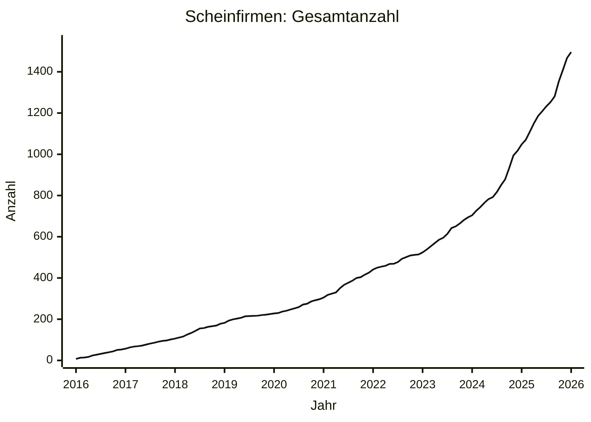

# Scheinfirmen Österreich — Statistik

| Stand | Gesamt | Erster Eintrag |
|-------|-------:|----------------|
| 2026-06-25T08:17:47 | 1496 | 2016-04-01 |

## Verlauf

```mermaid
---
config:
  themeVariables:
    xyChart:
      plotColorPalette: "#111111"
---
xychart-beta
    title "Scheinfirmen: Gesamtanzahl"
    x-axis "Jahr" 2016 --> 2026
    y-axis "Anzahl" 0 --> 1546
    line [7, 13, 14, 17, 24, 28, 32, 36, 40, 44, 51, 53, 57, 63, 67, 69, 72, 77, 82, 86, 91, 95, 97, 102, 106, 111, 116, 126, 134, 144, 155, 157, 163, 166, 169, 178, 182, 193, 199, 203, 207, 214, 215, 216, 217, 220, 222, 225, 228, 230, 237, 241, 247, 253, 259, 271, 275, 286, 292, 297, 305, 318, 324, 330, 351, 367, 377, 387, 400, 404, 416, 426, 441, 450, 455, 459, 468, 469, 477, 493, 501, 509, 512, 514, 524, 538, 554, 570, 586, 595, 614, 642, 650, 664, 681, 694, 704, 726, 744, 765, 783, 792, 817, 850, 878, 934, 994, 1017, 1048, 1070, 1110, 1151, 1186, 1209, 1233, 1253, 1281, 1353, 1409, 1467, 1496]
```

## Neueste Scheinfirmen (letzte 30 Tage)

| Name | UID | Anschrift |
|------|-----|-----------|
| A.D.M.K. GmbH | ATU76562346 | 1230 Wien, Birostraße 11/6 |
| ANUMASU Karunaker Reddy | ATU80861319 | 1230 Wien, Perfektastraße 18 |
| ASENOV Asen Iliev |  | 1210 Wien, Brünner Straße 124/53 |
| Alqasim Bau GmbH | ATU80846747 | 1100 Wien, Absberggasse 29 |
| Amir construct KG | ATU80674227 | 1200 Wien, Donaueschingenstraße 21/8 |
| Bellak Handels GmbH |  | 1200 Wien, Hartlgasse 20 |
| Berno Bau GmbH | ATU76130848 | 1220 Wien, Hirschstettner Straße 19 |
| DJORDJEVIC | ATU80754836 | 1230 Wien, Breitenfurter Straße 320//1/111 |
| DURA Vasile |  | 2441 Mitterndorf/Fischa, Gartenstraße 17/2 |
| DUSKOVA Anna |  | 2353 Guntramsdorf, Münchendorferstraße 16 / Tür 4 |
| EPURE Iustin-Sebastian | ATU80788701 | 1120 Wien, Rauchgasse 23 |
| ERTEKIN Hasan | ATU82570727 | 2333 Leopoldsdorf, Oberlaaerstraße 55 |
| FICZERE Jenö | ATU77530539 | 7464 Markt Neuhodis, Graben 17 |
| Firoza Bau GmbH | ATU81976319 | 1210 Wien, Hofherr-Schrantz-Gasse 2 |
| KA Personalservice GmbH | ATU81898813 | 7464 Markt Neuhodis, Graben 17 |
| KIROV Zhelyazko Ankov |  | 1050 Wien, Straußengasse 3/9 |
| KOLOMPAR Rezi | ATU82049418 | 1110 Wien, Sedlitzkygasse 14 |
| KUZMA Jozef | ATU81873536 | 1230 Wien, Draschestraße 26 |
| M. TRANS SERVICE Kleintransport GmbH | ATU80370439 | 1180 Wien, Weinhauser Gasse 5 |
| Mirkovic Reinigung e.U. | ATU74819235 | 1100 Wien, Sickingengasse 13 |
| NEMETH Sandor | ATU81491609 | 2201 Hagenbrunn, Sechste Gasse 2 |
| PBS Professional Business Services e.U | ATU67459911 | 1220 Wien, Gisela-Legath-Gasse 5 |
| PETRAS Geza | ATU73620548 | 4030 Linz, Matthäus-Herzog-Straße 3/4.ST.39 |
| PISTA David |  | 2353 Guntramsdorf, Münchendorferstraße 16 |
| POMPA Milan |  | 2353 Guntramsdorf, Münchendorferstraße 16 |
| POPOFF György | ATU56983955 | 1210 Wien, Brünner Straße 213/236 |
| RS4U Solution GmbH | ATU77555334 | 1140 Wien, Felbigergasse 45/12/EG |
| Roommaster Roommaker GmbH | ATU65836768 | 1230 Wien, Tenschertstraße 5 |
| SAMU Teli |  | 1020 Wien, Volkertstraße 14/9 |
| SAVIC Bozidar | ATU79891529 | 2231 Strasshof/Nordbahn, Georg-Weissel-Straße 8 |
| SINGH Harsimren | ATU79386335 | 1100 Wien, Senefeldergasse 77 |
| SIPOSOVA Kristina |  | 2353 Guntramsdorf, Münchendorferstraße 16/4 |
| SIPOSOVA Natalia |  | 1120 Wien, Siebertgasse 6 |
| SUNDARAGIRI Shankar | ATU80078719 | 1120 Wien, Tichtelgasse 21 |
| Singletop Consulting GmbH | ATU57952718 | 2273 Hohenau/March, Kirchengasse 12/2 |
| Stanic G4 GmbH | ATU57998803 | 1120 Wien, Spießhammergasse 4/1 |
| UHLA Jozef |  | 2353 Guntramsdorf, Münchendorferstraße 16 |
| UHLAROVA Maria |  | 2353 Guntramsdorf, Münchendorferstraße 16 |