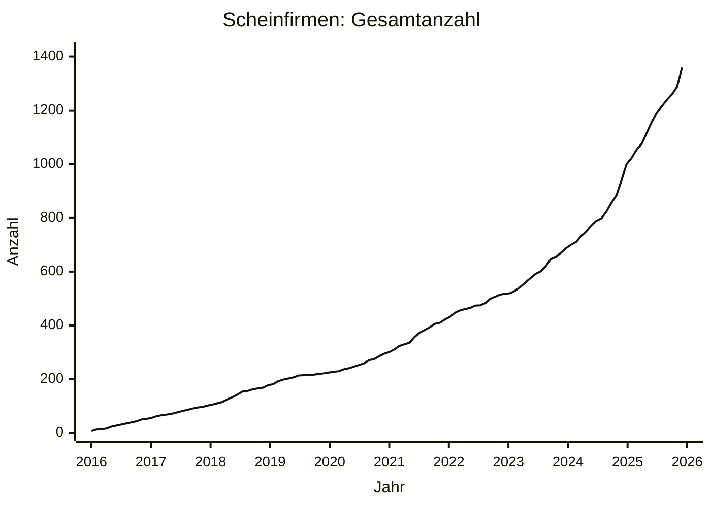

# Scheinfirmen Österreich — Statistik

| Stand | Gesamt | Erster Eintrag |
|-------|-------:|----------------|
| 2026-04-09T06:41:05 | 1374 | 2016-04-01 |

## Verlauf

```mermaid
---
config:
  themeVariables:
    xyChart:
      plotColorPalette: "#111111"
---
xychart-beta
    title "Scheinfirmen: Gesamtanzahl"
    x-axis "Jahr" 2016 --> 2026
    y-axis "Anzahl" 0 --> 1424
    line [7, 13, 14, 17, 24, 28, 32, 36, 40, 44, 51, 53, 57, 63, 67, 69, 72, 77, 82, 86, 91, 95, 97, 102, 106, 111, 116, 126, 134, 144, 155, 157, 163, 166, 169, 178, 182, 193, 199, 203, 207, 214, 215, 216, 217, 220, 222, 225, 228, 230, 237, 241, 247, 253, 259, 271, 275, 286, 295, 301, 311, 324, 330, 336, 357, 373, 383, 393, 406, 410, 422, 432, 447, 456, 461, 465, 474, 475, 483, 499, 507, 515, 518, 520, 530, 544, 560, 576, 592, 601, 620, 648, 656, 670, 687, 700, 710, 732, 750, 771, 789, 798, 823, 856, 884, 940, 1000, 1023, 1054, 1076, 1116, 1157, 1192, 1215, 1239, 1259, 1287, 1359, 1374]
```

## Neueste Scheinfirmen (letzte 30 Tage)

| Name | UID | Anschrift |
|------|-----|-----------|
| Aran Bike GmbH | ATU81293903 | 4810 Gmunden, Badgasse 1 |
| B&R Wohn- und Anlagenbau GmbH | ATU75363713 | 1010 Wien, Annagasse 5 |
| BAJNAR Radek | ATU82339239 | 1050 Wien, Fendigasse 11 |
| BEK Taxi GmbH | ATU81718125 | 1030 Wien, Ungargasse 23 |
| BLAZSIK Valentina | ATU81618019 | 1100 Wien, Columbusgasse 74 |
| BOLLADI Ramreddy | ATU69676004 | 1110 Wien, Lorystraße 73 |
| BUHAB Warenhandels GmbH | ATU81757715 | 1200 Wien, Hartlgasse 20 |
| CERVENKA Michal | ATU82134628 | 1170 Wien, Blumengasse 49 |
| CLEAN QUEENM e.U. | ATU79707319 | 1220 Wien, Wulzendorfstraße 92-94 |
| Canecky GmbH | ATU77943415 | 1230 Wien, Richard-Strauss-Straße 18 |
| Carlief GmbH | ATU80112012 | 1120 Wien, Aichholzgasse 5 |
| DANIEL Jan | ATU82141503 | 1170 Wien, Blumengasse 49 |
| DG Plus Baukonstrukt GmbH | ATU69609079 | 1200 Wien, Handelskai 94-96 |
| Dani¿s Clean Service e.U. | ATU72735016 | 1230 Wien, Ketzergasse 65b |
| ENESSEY Bruno Ferenc |  | 7464 Markt Neuhodis, Graben 17 |
| FEJES Bence | ATU82709446 | 6330 Kufstein, Siebenbürger Straße 22 |
| FIALA Robert |  | 1170 Wien, Blumengasse 49 |
| G.rajender KG | ATU76599218 | 1110 Wien, Lorystraße 73 |
| GOZORA Stefan | ATU82558215 | 1060 Wien, Mollardgasse 50 |
| GRONZIK Richard | ATU82182102 | 1030 Wien, Schlachthausgasse 16 |
| Gobolladi KG |  | 1110 Wien, Lorystraße 73/8-9 |
| HAAG Philipp | ATU78990709 | 6020 Innsbruck, Premstraße 31/12 |
| HADZHIEV Radoslav Georgiev | ATU82647619 | 1110 Wien, Lorystraße 73 |
| HORVATH Laszlo | ATU81249506 | 7571 Rudersdorf, Hauptstraße 37 |
| HUBLIK Miroslav | ATU82363425 | 1190 Wien, Barawitzkagasse 21 |
| Horizons Kitchen KG | ATU82227412 | 1050 Wien, Straußengasse 3 |
| JAMBOR Katalin Dzsenifer | ATU81775125 | 1100 Wien, Quellenstraße 43 |
| KIRALY Krisztian | ATU82105507 | 1100 Wien, Knöllgasse 2 |
| KOLOMPAR Klaudia Nikoletta |  | 1110 Wien, Sedlitzkygasse 14 |
| KOLOMPAR Sebastian | ATU79470449 | 1100 Wien, Knöllgasse 74 |
| KOVAC Jaroslav | ATU82463718 | 1220 Wien, Donaufelder Straße 205/2 |
| KOVAC Jozef | ATU82452828 | 1200 Wien, Engerthstraße 102 |
| KOVAC Maros | ATU82414709 | 1200 Wien, Jägerstraße 21 |
| LACKOVICOVA Marcela | ATU81961708 | 1120 Wien, Siebertgasse 6 |
| M & V ILIC GmbH |  | 2601 Sollenau, Querstraße 23 |
| METRIX Projects GmbH | ATU82257969 | 1110 Wien, Ehamgasse 42-44 |
| MEZEI Bela | ATU82111135 | 1100 Wien, Gudrunstraße 172 |
| MIGO Taxi KG | ATU68635435 | 1160 Wien, Hasnerstraße 23 |
| MIROSLOV Daniel | ATU81429606 | 1200 Wien, Allerheiligenplatz 3 |
| MITEV Atanas |  | 1100 Wien, Erlachgasse 137 |
| MOCSARI Tamas | ATU81770807 | 1200 Wien, Hartlgasse 14 |
| MOLNAR Elizabet | ATU81780789 | 1180 Wien, Köhlergasse 5 |
| MUB Gastro GmbH | ATU68440644 | 1200 Wien, Dammstraße 8 |
| MoLo Infinity Delivery GmbH | ATU81007278 | 5023 Salzburg, Bachstraße 57 |
| NOVAKOVIC Mico | ATU81427608 | 1200 Wien, Klosterneuburger Straße 51 |
| ORICHEL Mario | ATU82430512 | 1160 Wien, Hasnerstraße 36 |
| PAP Zoltan |  | 7571 Rudersdorf, Hauptstraße 37 |
| PODRIC Velimir | ATU72029235 | 2601 Sollenau, Querstraße 23 |
| POLAK Karel | ATU81471104 | 1180 Wien, Martinstraße 10 |
| REHBAR LOGISTIK GmbH | ATU81967659 | 1120 Wien, Siebertgasse 6 |
| RENOVIT Engineering GmbH | ATU65431008 | 1200 Wien, Brigittenauer Lände 36 |
| RUDZITIS Arturs |  | 1170 Wien, Römergasse 83 |
| RiseCitiee Real Estate Gmbh | ATU76065801 | 1190 Wien, Döblinger Hauptstraße 82 |
| SIMEK Robert |  | 1190 Wien, Barawitzkagasse 21 |
| SLAMA Pavel |  | 1050 Wien, Gassergasse 27 |
| STANCIU Felicia |  | 1100 Wien, Waldgasse 13-15 |
| SanLorenzo Development GmbH | ATU78896759 | 1110 Wien, Simmeringer Hauptstraße 24 |
| Sokol Interior Design GmbH | ATU70986668 | 1030 Wien, Klimschgasse 19-21/1 |
| TAL Building GmbH | ATU76434878 | 1220 Wien, Sonnenallee 110 |
| TechVersand e.U. | ATU81734134 | 1230 Wien, Triester Straße 238 |
| VASILJEVIC Jelena | ATU81898225 | 1150 Wien, Felberstraße 2 |
| ZÜCHNER Thomas | ATU80950516 | 3335 Weyer, Bahnpromenade 12 |