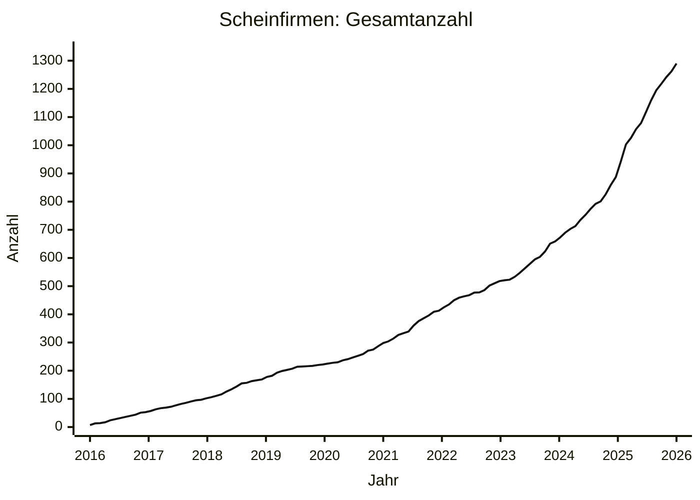

# Scheinfirmen Österreich — Statistik

| Stand | Gesamt | Erster Eintrag |
|-------|-------:|----------------|
| 2026-02-26T06:46:09 | 1290 | 2016-04-01 |

## Verlauf

```mermaid
---
config:
  themeVariables:
    xyChart:
      plotColorPalette: "#111111"
---
xychart-beta
    title "Scheinfirmen: Gesamtanzahl"
    x-axis "Jahr" 2016 --> 2026
    y-axis "Anzahl" 0 --> 1340
    line [7, 13, 14, 17, 24, 28, 32, 36, 40, 44, 51, 53, 57, 63, 67, 69, 72, 77, 82, 86, 91, 95, 97, 102, 106, 111, 116, 126, 134, 144, 155, 157, 163, 166, 169, 178, 182, 193, 199, 203, 207, 214, 215, 216, 217, 220, 222, 225, 228, 230, 237, 241, 247, 253, 259, 271, 275, 287, 298, 304, 314, 327, 333, 339, 360, 376, 386, 396, 409, 413, 425, 435, 450, 459, 464, 468, 477, 478, 486, 502, 510, 518, 521, 523, 533, 547, 563, 579, 595, 604, 623, 651, 659, 673, 690, 703, 713, 735, 753, 774, 792, 801, 826, 859, 887, 943, 1003, 1026, 1057, 1079, 1119, 1160, 1195, 1218, 1242, 1262, 1290]
```

## Neueste Scheinfirmen (letzte 30 Tage)

| Name | UID | Anschrift |
|------|-----|-----------|
| ADAM Ervin | ATU81732136 | 8020 Graz, Neubaugasse 24 |
| AKARAPU Vinesh Reddy | ATU72312124 | 1220 Wien, Stadlbreiten 11 |
| Ahmet Bulduk GmbH | ATU15647405 | 1110 Wien, Am Kanal 27 |
| Auto MANS Logistik GmbH | ATU79780809 | 1030 Wien, Obere Viaduktgasse 26 |
| BB Kleintransport KG | ATU77209307 | 1200 Wien, Hellwagstraße 3 |
| BlackMoney GmbH | ATU78574749 | 1120 Wien, Hetzendorfer Straße 100 |
| D.A. Reinglanz GmbH | ATU81333709 | 1020 Wien, Lassallestraße 7B |
| DEMETER Monika Sara | ATU82203857 | 1200 Wien, Klosterneuburger Straße 28 |
| DUDAS Szimonetta |  | 1020 Wien, Körnergasse 5/10 |
| DUGMONICS Sandorne |  | 1200 Wien, Salzachstraße 1 |
| ESPACH Bau GmbH | ATU74641667 | 1150 Wien, Clementinengasse 6/4 |
| Eaventus Transport GmbH | ATU79988827 | 1120 Wien, Hetzendorfer Straße 100/4 |
| GASTRO EXPRESS KG |  | 1020 Wien, Rueppgasse 2/2.6 |
| GOMBOS Jozsef Karoly | ATU81976649 | 1220 Wien, Langobardenstraße 189 |
| Gelbstein Haustechnik GmbH | ATU71467156 | 1210 Wien, Brünner Straße 240 |
| Ikarus Transport GmbH | ATU81084229 | 1110 Wien, Simmeringer Hauptstraße 24 |
| Kurma GetränkehandelsgesmbH | ATU82117308 | 1110 Wien, Simmeringer Hauptstraße 43 |
| Mikulova Simona | ATU81238545 | 1160 Wien, Lambertgasse 15 |
| PUSKA Boris | ATU81904478 | 1200 Wien, Allerheiligenplatz 3 |
| Pacek Jan | ATU81904469 | 1030 Wien, Landstraßer Hauptstraße 131 |
| Rodic Gastro GmbH | ATU72349201 | 2011 Sierndorf, Prager Straße 17 |
| SMEJKAL Libor | ATU82169458 | 1190 Wien, Barawitzkagasse 21/3 |
| Sebusavac Handels GmbH | ATU76775036 | 1230 Wien, Levasseurgasse 3 |
| Sorhan Taxi KG | ATU80755425 | 1010 Wien, Seitenstettengasse 5 |
| TOTFALUSI Jozsef | ATU81405347 | 1050 Wien, Reinprechtsdorfer Straße 19 |
| Talocci M. e.U. | ATU82520069 | 1190 Wien, Hackhofergasse 1 |
| VALENCIUS Marius | ATU82261259 | 6020 Innsbruck, Kaufmannstraße 21b |
| VLM Aurora Immoinvest GmbH | ATU79056879 | 1120 Wien, Schönbrunner Straße 238 |
| YORDANOV Yordan Yordanov |  | 1150 Wien, Diefenbachgasse 40 |
| ZM Conbau GmbH | ATU77697912 | 1100 Wien, Alxingergasse 105 |
| ÖST Projekt GmbH | ATU80233445 | 1120 Wien, Krichbaumgasse 8 |