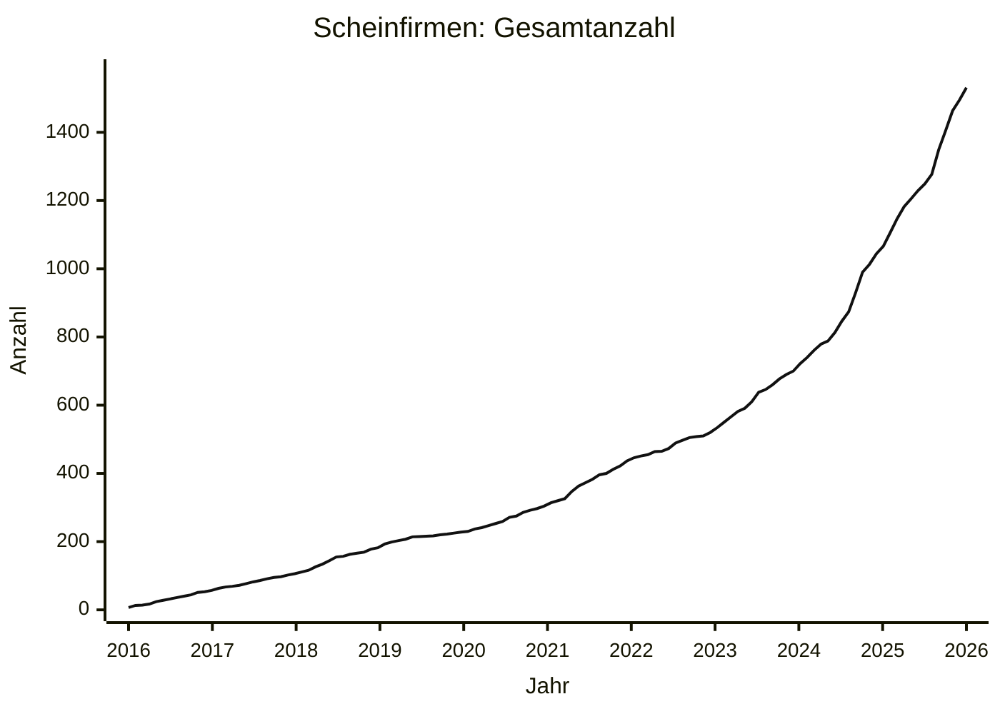

# Scheinfirmen Österreich — Statistik

| Stand | Gesamt | Erster Eintrag |
|-------|-------:|----------------|
| 2026-07-30T07:16:55 | 1531 | 2016-04-01 |

## Verlauf

```mermaid
---
config:
  themeVariables:
    xyChart:
      plotColorPalette: "#111111"
---
xychart-beta
    title "Scheinfirmen: Gesamtanzahl"
    x-axis "Jahr" 2016 --> 2026
    y-axis "Anzahl" 0 --> 1581
    line [7, 13, 14, 17, 24, 28, 32, 36, 40, 44, 51, 53, 57, 63, 67, 69, 72, 77, 82, 86, 91, 95, 97, 102, 106, 111, 116, 126, 134, 144, 155, 157, 163, 166, 169, 178, 182, 193, 199, 203, 207, 214, 215, 216, 217, 220, 222, 225, 228, 230, 237, 241, 247, 253, 259, 271, 275, 286, 292, 297, 304, 314, 320, 326, 347, 363, 373, 383, 396, 400, 412, 422, 437, 446, 451, 455, 464, 465, 473, 489, 497, 505, 508, 510, 520, 534, 550, 566, 582, 591, 610, 638, 646, 660, 677, 690, 700, 722, 740, 761, 779, 788, 813, 846, 874, 930, 990, 1013, 1044, 1066, 1106, 1147, 1182, 1205, 1229, 1249, 1277, 1349, 1405, 1463, 1495, 1531]
```

## Neueste Scheinfirmen (letzte 30 Tage)

| Name | UID | Anschrift |
|------|-----|-----------|
| A-K Autohandels GmbH | ATU82976647 | 1230 Wien, Birostraße 11 |
| AVGR Haustechnik GmbH | ATU66259158 | 1210 Wien, Ohmgasse 4 |
| AXI Trade GmbH | ATU59072309 | 1010 Wien, Sterngasse 3 |
| BADDAM Devender Reddy | ATU81244903 | 1230 Wien, Perfektastraße 18 |
| BALOGH Zsofia Panka | ATU82820226 | 1100 Wien, Quellenstraße 77 |
| BAP Bau GmbH | ATU76019229 | 1180 Wien, Währinger Straße 39 |
| BARTOS Zdenko |  | 1180 Wien, Schulgasse 63/7 |
| BIRNEATA Robert |  | 6890 Lustenau, Augartenstraße 20 |
| Bra-Sa Construct GesmbH | ATU81838479 | 1170 Wien, Wattgasse 76 |
| CINOVA Katarina |  | 5020 Salzburg, Gebirgsjägerplatz 1 |
| Cankar GmbH | ATU80698318 | 1180 Wien, Anastasius-Grün-Gasse 17 |
| GOFF Handel GmbH | ATU77486436 | 4600 Wels, Dragonerstraße 46/5 |
| Glamour Professionell GmbH | ATU81346438 | 1160 Wien, Gablenzgasse 14/3 |
| HATKO Bau GmbH | ATU75605178 | 1170 Wien, Dornbacher Straße 97-99/1 |
| JOVANOVIC Slavica | ATU80321108 | 1110 Wien, Hauffgasse 43 |
| KHAN Hafiza Mehak | ATU81136058 | 6261 Strass/Zillertal, Gewerbegebiet Nord 193 |
| KIRILOV Kosta Asenov |  | 1100 Wien, Scheugasse 9/14 |
| LAKATOS Vera | ATU83211819 | 1110 Wien, Geiselbergstraße 16-24/12/8 |
| Lombard Solution Consultancy GmbH | ATU78636709 | 4063 Hörsching, Hofgasse 11 |
| MALIK Vladimir | ATU81904003 | 1160 Wien, Hasnerstraße 36 |
| MANOLE Hermina | ATU80786927 | 3003 Gablitz, Hauptstraße 28/9 |
| MK Interio GmbH | ATU74354502 | 1220 Wien, Rautenweg 22 |
| Muhammad Bilal Kleintransport e.U. | ATU83138356 | 1220 Wien, Langobardenstraße 189 |
| NEMETH Daniel |  | 1100 Wien, Quellenstraße 4 |
| NHS-JPP Management GmbH in Liquidation | ATU77543357 | 1140 Wien, Josef-Palme-Platz 4/12 |
| Neo Trans Clean GmbH | ATU66640977 | 1100 Wien, Erlachgasse 137/31 |
| POMPOVA Annamaria |  | 1100 Wien, Puchsbaumgasse 37 |
| RIGO Mario Sandor | ATU83097738 | 1100 Wien, Senefeldergasse 56/31 |
| Rivera Handel GmbH | ATU80602448 | 4600 Wels, Dragonerstraße 46 |
| SINGH Surinder | ATU77973105 | 1100 Wien, Malborghetgasse 33 |
| STEIGLER Erik Zoltan | ATU83097505 | 1100 Wien, Senefeldergasse 56/31 |
| Safety Personal GmbH | ATU82446989 | 1110 Wien, Kaiser-Ebersdorfer Straße 112-114/4/22 |
| TITAN GmbH | ATU71643956 | 8055 Seiersberg-Pirka, Feldkirchner Straße 111 |
| TRENDOV Dragi | ATU61887337 | 1120 Wien, Koflergasse 9/3 |
| Transport Heroes GmbH | ATU79501816 | 1160 Wien, Neulerchenfelder Straße 86/20 |
| WILLTOOL GmbH | ATU73845949 | 1140 Wien, Hadikgasse 64 |