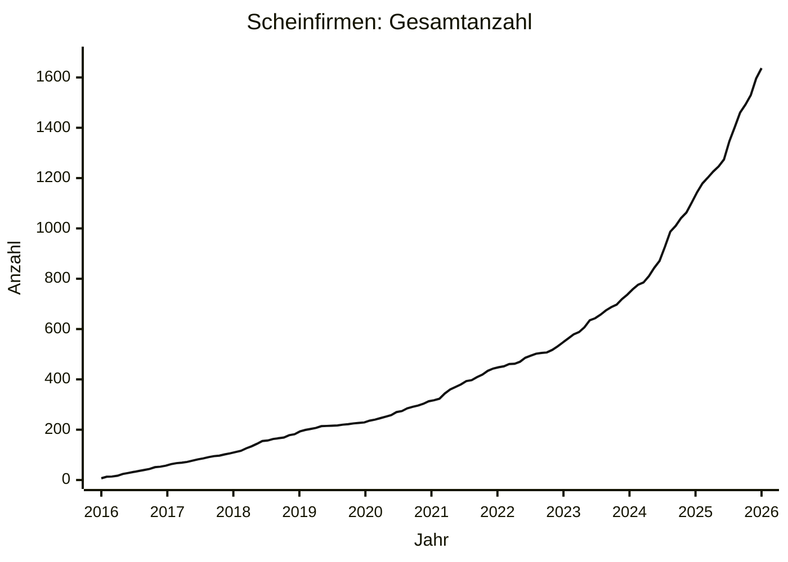

# Scheinfirmen Österreich — Statistik

| Stand | Gesamt | Erster Eintrag |
|-------|-------:|----------------|
| 2026-09-19T09:18:03 | 1637 | 2016-04-01 |

## Verlauf

```mermaid
---
config:
  themeVariables:
    xyChart:
      plotColorPalette: "#111111"
---
xychart-beta
    title "Scheinfirmen: Gesamtanzahl"
    x-axis "Jahr" 2016 --> 2026
    y-axis "Anzahl" 0 --> 1687
    line [7, 13, 14, 17, 24, 28, 32, 36, 40, 44, 51, 53, 57, 63, 67, 69, 72, 77, 82, 86, 91, 95, 97, 102, 106, 111, 116, 126, 134, 144, 155, 157, 163, 166, 169, 178, 182, 193, 199, 203, 207, 214, 215, 216, 217, 220, 222, 225, 227, 229, 236, 240, 246, 252, 258, 270, 274, 285, 291, 296, 303, 313, 317, 323, 344, 360, 370, 380, 393, 397, 409, 419, 434, 443, 448, 452, 461, 462, 470, 486, 494, 502, 505, 507, 517, 531, 547, 563, 579, 588, 607, 635, 643, 657, 674, 687, 697, 719, 737, 758, 776, 785, 810, 843, 871, 927, 987, 1010, 1041, 1063, 1103, 1144, 1179, 1202, 1226, 1246, 1274, 1346, 1402, 1460, 1492, 1530, 1596, 1637]
```

## Neueste Scheinfirmen (letzte 30 Tage)

| Name | UID | Anschrift |
|------|-----|-----------|
| ACSAI Geza |  | 7503 Großpetersdorf, Raiffeisenplatz 1 |
| AGHOVA Simona |  | 1170 Wien, Wattgasse 73/8 |
| ALHA Transport GmbH | ATU81027336 | 1200 Wien, Handelskai 102-112 |
| AMREIN Gabor |  | 7503 Großpetersdorf, Raiffeisenplatz 1 |
| ANTAL Tamas | ATU82694979 | 1140 Wien, Märzstraße 158/1-2 |
| ASENOV Ivan |  | 1050 Wien, Margaretenstraße 102/1 |
| ASZODI Gyula |  | 7503 Großpetersdorf, Raiffeisenplatz 1 |
| BAICU Ionut |  | 1100 Wien, Kudlichgasse 23 |
| BALOG Ferenc | ATU83102713 | 1190 Wien, Barawitzkagasse 32 |
| BARABAS Istvan |  | 7503 Großpetersdorf, Raiffeisenplatz 1 |
| BEDA KG | ATU65623202 | 1140 Wien, Lützowgasse 14A |
| BOEM BB GmbH | ATU78179445 | 1150 Wien, Märzstraße 96/Lokal |
| BORSAI Felix | ATU82380308 | 8262 Ilz, Neudorf bei Ilz 147 |
| Betonfloor Industrieböden GmbH | ATU77820379 | 7201 Neudörfl, Hauptstraße 167 |
| BÖRÖCZ Erika |  | 7503 Großpetersdorf, Raiffeisenplatz 1 |
| CARPACI Maria |  | 1210 Wien, Grellgasse 7 |
| COCO Trade B GmbH | ATU81912913 | 2231 Strasshof an der Nordbahn, Gewerbeparkstraße 21 |
| CSAGOLA Tamas | ATU79844046 | 7503 Großpetersdorf, Raiffeisenplatz 1 |
| DOMBROVSKIS Felikss | ATU83126118 | 1190 Wien, Heiligenstädter Straße 170 |
| DORDE Ivica | ATU71924803 | 1160 Wien, Nauseagasse 28 |
| ELD Bau GmbH | ATU78235447 | 2100 Korneuburg, Wiener Straße 25 |
| FARKAS Gyula Roland | ATU67711906 | 7503 Großpetersdorf, Raiffeisenplatz 1 |
| GAL Erika |  | 1200 Wien, Gerhardusgasse 30/13 |
| GALDA Helga |  | 8262 Ilz, Neudorf bei Ilz 147 |
| GREGUS Eva |  | 8262 Ilz, Neudorf bei Ilz 147 |
| HADJI Anouar | ATU82457912 | 1210 Wien, Brünner Straße 240/208 |
| HANEX Holding und Transport GmbH | ATU73840347 | 1230 Wien, Mellergasse 4 |
| HERZ BAU GmbH | ATU82215103 | 2201 Hagenbrunn, Brünnerstraße 31 |
| HESZLER Monika |  | 7503 Großpetersdorf, Raiffeisenplatz 1 |
| HST 321 Projektentwicklung GMBH | ATU76200512 | 1140 Wien, Breitenseer Straße 18 |
| ILIC Milos | ATU74122656 | 1050 Wien, Arbeitergasse 21/2-5 |
| JG Hausbetreuung & Reinigungs GmbH | ATU76885658 | 1010 Wien, Marc-Aurel-Straße 7 |
| KOPFSCHLÄGL Mate | ATU79318579 | 7503 Großpetersdorf, Raiffeisenplatz 1 |
| KUSKUNTLA Prabhanjan Reddy | ATU83267126 | 1100 Wien, Kudlichgasse 23 |
| LEVINSKAS Alvidas |  | 1230 Wien, Ketzergasse 58 |
| LIPTAI Zoltan | ATU80031957 | 7503 Großpetersdorf, Raiffeisenplatz 1 |
| Lemon clean service GmbH | ATU75862504 | 1230 Wien, Rossakgasse 8 |
| M S Logistik KG | ATU79951937 | 5620 Schwarzach/Pongau, Salzachweg 6 |
| MAHMOOD Atif | ATU73620637 | 7423 Pinkafeld, Gerbergasse 32/15 |
| MARTINS DE CARVALHO Eduardo Miguel |  | 5550 Radstadt, Schloßstraße 45/1 |
| MATYAS Erik | ATU82259903 | 1170 Wien, Hernalser Hauptstraße 9 |
| MESZLER Csaba | ATU78746369 | 7503 Großpetersdorf, Raiffeisenplatz 1 |
| MEZEIOVA Katarina |  | 1100 Wien, Puchsbaumgasse 37/14 |
| MLYNAROVIC Peter | ATU82338908 | 1160 Wien, Menzelgasse 11/4 |
| MOLNAR Patrik |  | 7503 Großpetersdorf, Raiffeisenplatz 1 |
| MÜLLER Tibor Laszlo |  | 7503 Großpetersdorf, Raiffeisenplatz 1 |
| Nexaro GmbH | ATU82461667 | 1030 Wien, Kleistgasse 30/Top1 |
| PATEL Keval Jagdish | ATU83172816 | 1100 Wien, Kudlichgasse 23/14 |
| PENEV Kiril |  | 1100 Wien, Herndlgasse 3 |
| PRAZIENKOVA Ivana | ATU80628625 | 1100 Wien, Laxenburger Straße 32 |
| RADEV Angel Yuriev |  | 1120 Wien, Eckartsaugasse 5 |
| SALAY Michal | ATU82277858 | 1170 Wien, Hernalser Hauptstraße 9 |
| SIZ Handels GmbH | ATU74505458 | 1110 Wien, Simmeringer Hauptstraße 24 |
| Scheumbauer Bau GmbH | ATU21389101 | 1190 Wien, Hackhofergasse 1 |
| Sky Service GmbH | ATU73398824 | 1230 Wien, Rossakgasse 8 |
| VEGH Tibor | ATU82817828 | 1200 Wien, Hartlgasse 20/10 |
| VELMA Mohan Reddy | ATU81406756 | 1110 Wien, Kudlichgasse 23 |
| Wintageluxury GmbH | ATU82165336 | 1010 Wien, Jasomirgottstraße 4 |
| YHY Taxi Cars GmbH | ATU81313918 | 1100 Wien, Inzersdorfer Straße 18 |