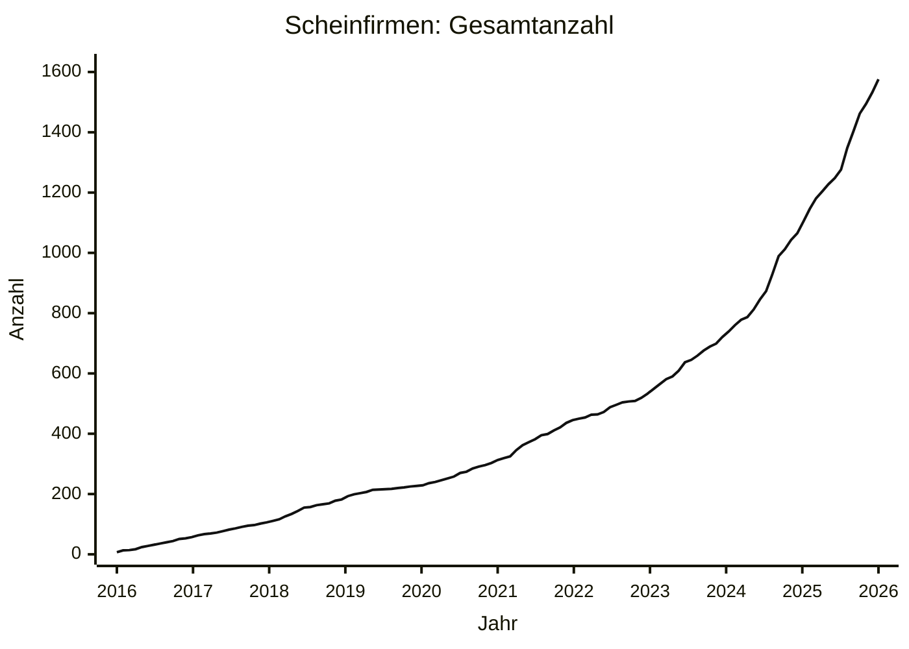

# Scheinfirmen Österreich — Statistik

| Stand | Gesamt | Erster Eintrag |
|-------|-------:|----------------|
| 2026-08-20T05:08:00 | 1576 | 2016-04-01 |

## Verlauf

```mermaid
---
config:
  themeVariables:
    xyChart:
      plotColorPalette: "#111111"
---
xychart-beta
    title "Scheinfirmen: Gesamtanzahl"
    x-axis "Jahr" 2016 --> 2026
    y-axis "Anzahl" 0 --> 1626
    line [7, 13, 14, 17, 24, 28, 32, 36, 40, 44, 51, 53, 57, 63, 67, 69, 72, 77, 82, 86, 91, 95, 97, 102, 106, 111, 116, 126, 134, 144, 155, 157, 163, 166, 169, 178, 182, 193, 199, 203, 207, 214, 215, 216, 217, 220, 222, 225, 227, 229, 236, 240, 246, 252, 258, 270, 274, 285, 291, 296, 303, 313, 319, 325, 346, 362, 372, 382, 395, 399, 411, 421, 436, 445, 450, 454, 463, 464, 472, 488, 496, 504, 507, 509, 519, 533, 549, 565, 581, 590, 609, 637, 645, 659, 676, 689, 699, 721, 739, 760, 778, 787, 812, 845, 873, 929, 989, 1012, 1043, 1065, 1105, 1146, 1181, 1204, 1228, 1248, 1276, 1348, 1404, 1462, 1494, 1532, 1576]
```

## Neueste Scheinfirmen (letzte 30 Tage)

| Name | UID | Anschrift |
|------|-----|-----------|
| AHMED Rafaqat Mehmood | ATU72159148 | 1100 Wien, Neilreichgasse 17 |
| ASENOV Asen Velev |  | 1100 Wien, Scheugasse 9 |
| Abaci Express GmbH | ATU80229316 | 1100 Wien, Keplergasse 8/7 |
| BABIC Trading GmbH | ATU80085346 | 1170 Wien, Frauenfelderstraße 15/16 |
| BARCZA Gabor |  | 7503 Großpetersdorf, Raiffeisenplatz 1 |
| BARCZA-DIAN Eva |  | 7503 Großpetersdorf, Raiffeisenplatz 1 |
| BARTOS Zdenko |  | 1180 Wien, Schulgasse 63/7 |
| BE STAFF project planning & service GmbH | ATU74253229 | 1090 Wien, Zimmermanngasse 8 |
| BESA Bau- und Handels GmbH | ATU78748946 | 2442 Unterwaltersdorf, Johann Miltner-Straße 9 |
| BUKTA Ildiko |  | 7503 Großpetersdorf, Raiffeisenplatz 1 |
| Best Way Service GmbH | ATU78262078 | 1220 Wien, Erzherzog-Karl-Straße 5A |
| Blackstone One GmbH | ATU81806459 | 1090 Wien, Berggasse 16 DG |
| Bra-Sa Construct GesmbH | ATU81838479 | 1170 Wien, Wattgasse 76 |
| Cankar GmbH | ATU80698318 | 1180 Wien, Anastasius-Grün-Gasse 17 |
| DEMIREV Angel Dimitrov |  | 1200 Wien, Salzachstraße 11 |
| DOVALOVA Simona |  | 1110 Wien, Hadatschgasse 7 |
| ERONI Bau GmbH | ATU80330009 | 1210 Wien, Leopoldauer Straße 157A/1/16 |
| El Graf Transport GmbH |  | 1230 Wien, Großmarktstraße 4 |
| FEHER Viktor | ATU83075468 | 1100 Wien, Quellenstraße 177 |
| GANYI Maria | ATU83335268 | 1130 Wien, Konrad-Duden-Gasse 58 |
| GODO Daniel |  | 7503 Großpetersdorf, Raiffeisenplatz 1/3 |
| GRBS KG | ATU82466519 | 1110 Wien, Mautner-Markhof-Gasse 10 |
| Glow Clean GmbH | ATU82453523 | 2435 Ebergassing, Franzensthalstraße 21b |
| Glow Clean GmbH | ATU80546679 | 1050 Wien, Margaretengürtel 74-74A/4/10 |
| HAGA Edina |  | 1120 Wien, Siebertgasse 6 |
| HAVASI Attila | ATU80550958 | 7503 Großpetersdorf, Raiffeisenplatz 1 |
| HOMENSZKI Adam Istvan |  | 7503 Großpetersdorf, Raiffeisenplatz 1/3 |
| HRISTOV Kiril Stefchov | ATU81225238 | 1200 Wien, Salzachstraße 11 |
| Holle33 Souvenirs GmbH | ATU81855306 | 1010 Wien, Naglergasse 3 |
| KIRILOV Kosta Asenov |  | 1100 Wien, Scheugasse 9/14 |
| KISS Janos |  | 7503 Großpetersdorf, Raiffeisenplatz 1 |
| LAKATOS Vera | ATU83211819 | 1110 Wien, Geiselbergstraße 16-24/12/8 |
| Lombard Solution Consultancy GmbH | ATU78636709 | 4063 Hörsching, Hofgasse 11 |
| MATA Sandor | ATU82541448 | 1100 Wien, Quellenstraße 75 |
| Mylez Stores GmbH | ATU77735603 | 1070 Wien, Halbgasse 7 |
| NEMETH Daniel |  | 1100 Wien, Quellenstraße 4 |
| NEUNER Claudia Theresa | ATU81672904 | 6401 Inzing, Hauptstraße 31 |
| Neo Trans Clean GmbH | ATU66640977 | 1100 Wien, Erlachgasse 137/31 |
| Novius GmbH | ATU75807968 | 1230 Wien, Elisenstraße 18 |
| O.S.B. Projektentwicklungs- u. Sanierungs GmbH | ATU79114548 | 1110 Wien, Simmeringer Hauptstraße 24 |
| OA Compact Construction GmbH | ATU82242814 | 2372 Gießhübl, Perlhofgasse 2b |
| OROSZ Eva |  | 7503 Großpetersdorf, Raiffeisenplatz 1 |
| POMPOVA Zdenka |  | 1120 Wien, Siebertgasse 6 |
| QPV Invest GmbH | ATU79969358 | 1210 Wien, Hofherr-Schrantz-Gasse 2 |
| R. Sarko 1 Souvenirs GmbH | ATU79388404 | 1010 Wien, Rotenturmstraße 24 |
| RADUCANU Vasile-Marin | ATU81261689 | 1150 Wien, Staglgasse 12 |
| Robat I. Trade Handels GmbH | ATU82778326 | 1010 Wien, Jasomirgottstraße 4 |
| STEFANOV Panayot Asenov | ATU80663809 | 1210 Wien, Brünner Straße 124 |
| SUSHIL Sushil | ATU82410847 | 1100 Wien, Zohmanngasse 28 |
| Stanka VASILEVA KG | ATU63075139 | 1050 Wien, Margaretenstraße 99/8 |
| TAS Bau GmbH | ATU68164238 | 1170 Wien, Dornbacher Straße 5 |
| Tiger Baumalerei GmbH | ATU81100737 | 1100 Wien, Neilreichgasse 22 |
| TransSend Kleintransporte KG | ATU77725446 | 1030 Wien, Hagenmüllergasse 21-23 |
| Vera Reinigung e.U. | ATU79635147 | 1100 Wien, Hardtmuthgasse 53 |
| Üreci KG | ATU80055146 | 1230 Wien, Großmarktstraße 4A |