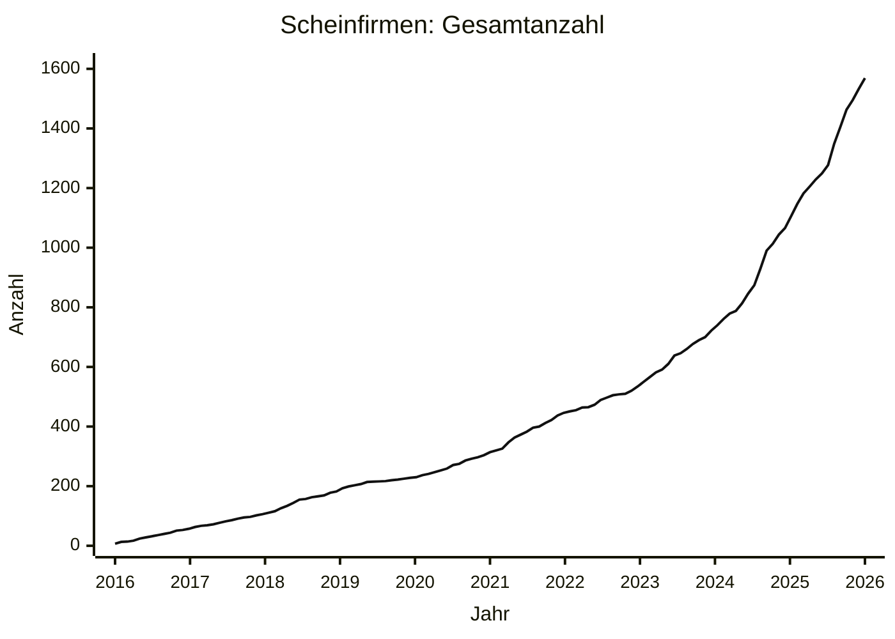

# Scheinfirmen Österreich — Statistik

| Stand | Gesamt | Erster Eintrag |
|-------|-------:|----------------|
| 2026-08-18T05:06:35 | 1569 | 2016-04-01 |

## Verlauf

```mermaid
---
config:
  themeVariables:
    xyChart:
      plotColorPalette: "#111111"
---
xychart-beta
    title "Scheinfirmen: Gesamtanzahl"
    x-axis "Jahr" 2016 --> 2026
    y-axis "Anzahl" 0 --> 1619
    line [7, 13, 14, 17, 24, 28, 32, 36, 40, 44, 51, 53, 57, 63, 67, 69, 72, 77, 82, 86, 91, 95, 97, 102, 106, 111, 116, 126, 134, 144, 155, 157, 163, 166, 169, 178, 182, 193, 199, 203, 207, 214, 215, 216, 217, 220, 222, 225, 228, 230, 237, 241, 247, 253, 259, 271, 275, 286, 292, 297, 304, 314, 320, 326, 347, 363, 373, 383, 396, 400, 412, 422, 437, 446, 451, 455, 464, 465, 473, 489, 497, 505, 508, 510, 520, 534, 550, 566, 582, 591, 610, 638, 646, 660, 677, 690, 700, 722, 740, 761, 779, 788, 813, 846, 874, 930, 990, 1013, 1044, 1066, 1106, 1147, 1182, 1205, 1229, 1249, 1277, 1349, 1405, 1463, 1495, 1533, 1569]
```

## Neueste Scheinfirmen (letzte 30 Tage)

| Name | UID | Anschrift |
|------|-----|-----------|
| ASENOV Asen Velev |  | 1100 Wien, Scheugasse 9 |
| Abaci Express GmbH | ATU80229316 | 1100 Wien, Keplergasse 8/7 |
| BABIC Trading GmbH | ATU80085346 | 1170 Wien, Frauenfelderstraße 15/16 |
| BARCZA Gabor |  | 7503 Großpetersdorf, Raiffeisenplatz 1 |
| BARCZA-DIAN Eva |  | 7503 Großpetersdorf, Raiffeisenplatz 1 |
| BARTOS Zdenko |  | 1180 Wien, Schulgasse 63/7 |
| BE STAFF project planning & service GmbH | ATU74253229 | 1090 Wien, Zimmermanngasse 8 |
| BESA Bau- und Handels GmbH | ATU78748946 | 2442 Unterwaltersdorf, Johann Miltner-Straße 9 |
| BUKTA Ildiko |  | 7503 Großpetersdorf, Raiffeisenplatz 1 |
| Blackstone One GmbH | ATU81806459 | 1090 Wien, Berggasse 16 DG |
| Bra-Sa Construct GesmbH | ATU81838479 | 1170 Wien, Wattgasse 76 |
| Cankar GmbH | ATU80698318 | 1180 Wien, Anastasius-Grün-Gasse 17 |
| DEMIREV Angel Dimitrov |  | 1200 Wien, Salzachstraße 11 |
| DOVALOVA Simona |  | 1110 Wien, Hadatschgasse 7 |
| ERONI Bau GmbH | ATU80330009 | 1210 Wien, Leopoldauer Straße 157A/1/16 |
| El Graf Transport GmbH |  | 1230 Wien, Großmarktstraße 4 |
| FEHER Viktor | ATU83075468 | 1100 Wien, Quellenstraße 177 |
| GANYI Maria | ATU83335268 | 1130 Wien, Konrad-Duden-Gasse 58 |
| GODO Daniel |  | 7503 Großpetersdorf, Raiffeisenplatz 1/3 |
| GRBS KG | ATU82466519 | 1110 Wien, Mautner-Markhof-Gasse 10 |
| Glow Clean GmbH | ATU82453523 | 2435 Ebergassing, Franzensthalstraße 21b |
| Glow Clean GmbH | ATU80546679 | 1050 Wien, Margaretengürtel 74-74A/4/10 |
| HATKO Bau GmbH | ATU75605178 | 1170 Wien, Dornbacher Straße 97-99/1 |
| HAVASI Attila | ATU80550958 | 7503 Großpetersdorf, Raiffeisenplatz 1 |
| HOMENSZKI Adam Istvan |  | 7503 Großpetersdorf, Raiffeisenplatz 1/3 |
| HRISTOV Kiril Stefchov | ATU81225238 | 1200 Wien, Salzachstraße 11 |
| Holle33 Souvenirs GmbH | ATU81855306 | 1010 Wien, Naglergasse 3 |
| KIRILOV Kosta Asenov |  | 1100 Wien, Scheugasse 9/14 |
| KISS Janos |  | 7503 Großpetersdorf, Raiffeisenplatz 1 |
| LAKATOS Vera | ATU83211819 | 1110 Wien, Geiselbergstraße 16-24/12/8 |
| Lombard Solution Consultancy GmbH | ATU78636709 | 4063 Hörsching, Hofgasse 11 |
| MANOLE Hermina | ATU80786927 | 3003 Gablitz, Hauptstraße 28/9 |
| MATA Sandor | ATU82541448 | 1100 Wien, Quellenstraße 75 |
| Mylez Stores GmbH | ATU77735603 | 1070 Wien, Halbgasse 7 |
| NEMETH Daniel |  | 1100 Wien, Quellenstraße 4 |
| NEUNER Claudia Theresa | ATU81672904 | 6401 Inzing, Hauptstraße 31 |
| NHS-JPP Management GmbH in Liquidation | ATU77543357 | 1140 Wien, Josef-Palme-Platz 4/12 |
| Neo Trans Clean GmbH | ATU66640977 | 1100 Wien, Erlachgasse 137/31 |
| Novius GmbH | ATU75807968 | 1230 Wien, Elisenstraße 18 |
| O.S.B. Projektentwicklungs- u. Sanierungs GmbH | ATU79114548 | 1110 Wien, Simmeringer Hauptstraße 24 |
| OA Compact Construction GmbH | ATU82242814 | 2372 Gießhübl, Perlhofgasse 2b |
| OROSZ Eva |  | 7503 Großpetersdorf, Raiffeisenplatz 1 |
| QPV Invest GmbH | ATU79969358 | 1210 Wien, Hofherr-Schrantz-Gasse 2 |
| RADUCANU Vasile-Marin | ATU81261689 | 1150 Wien, Staglgasse 12 |
| RIGO Mario Sandor | ATU83097738 | 1100 Wien, Senefeldergasse 56/31 |
| Robat I. Trade Handels GmbH | ATU82778326 | 1010 Wien, Jasomirgottstraße 4 |
| STEFANOV Panayot Asenov | ATU80663809 | 1210 Wien, Brünner Straße 124 |
| STEIGLER Erik Zoltan | ATU83097505 | 1100 Wien, Senefeldergasse 56/31 |
| SUSHIL Sushil | ATU82410847 | 1100 Wien, Zohmanngasse 28 |
| Safety Personal GmbH | ATU82446989 | 1110 Wien, Kaiser-Ebersdorfer Straße 112-114/4/22 |
| Stanka VASILEVA KG | ATU63075139 | 1050 Wien, Margaretenstraße 99/8 |
| TAS Bau GmbH | ATU68164238 | 1170 Wien, Dornbacher Straße 5 |
| TRENDOV Dragi | ATU61887337 | 1120 Wien, Koflergasse 9/3 |
| Vera Reinigung e.U. | ATU79635147 | 1100 Wien, Hardtmuthgasse 53 |