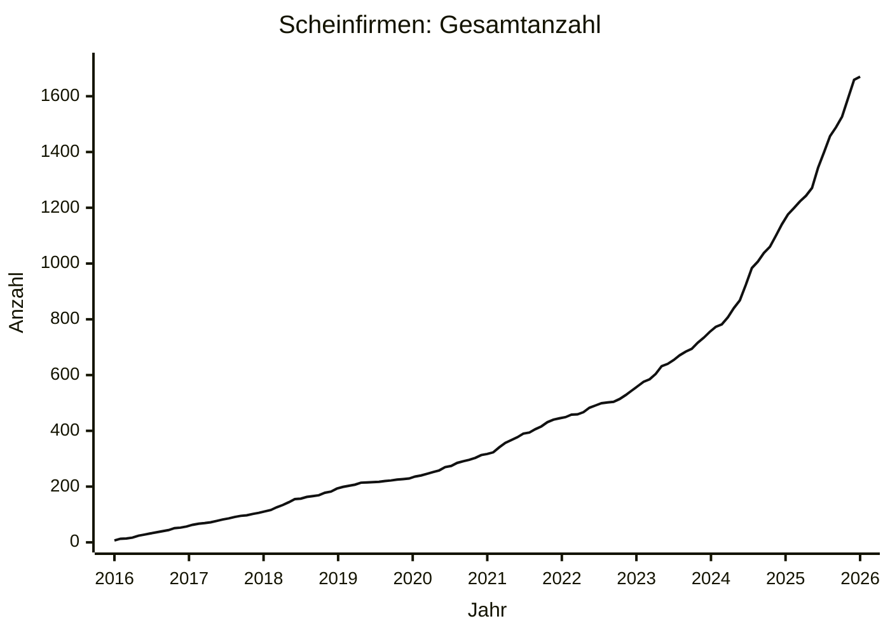

# Scheinfirmen Österreich — Statistik

| Stand | Gesamt | Erster Eintrag |
|-------|-------:|----------------|
| 2026-10-08T10:53:33 | 1670 | 2016-04-01 |

## Verlauf

```mermaid
---
config:
  themeVariables:
    xyChart:
      plotColorPalette: "#111111"
---
xychart-beta
    title "Scheinfirmen: Gesamtanzahl"
    x-axis "Jahr" 2016 --> 2026
    y-axis "Anzahl" 0 --> 1720
    line [7, 13, 14, 17, 24, 28, 32, 36, 40, 44, 51, 53, 57, 63, 67, 69, 72, 77, 82, 86, 91, 95, 97, 102, 106, 111, 116, 126, 134, 144, 155, 157, 163, 166, 169, 178, 182, 193, 199, 203, 207, 214, 215, 216, 217, 220, 222, 225, 227, 229, 236, 240, 246, 252, 258, 270, 274, 285, 291, 296, 303, 313, 317, 323, 341, 357, 367, 377, 390, 394, 406, 416, 431, 440, 445, 449, 458, 459, 467, 483, 491, 499, 502, 504, 514, 528, 544, 560, 576, 585, 604, 632, 640, 654, 671, 684, 694, 716, 734, 755, 773, 782, 807, 840, 868, 924, 984, 1007, 1038, 1060, 1100, 1141, 1176, 1199, 1223, 1243, 1271, 1343, 1399, 1457, 1489, 1527, 1593, 1659, 1670]
```

## Neueste Scheinfirmen (letzte 30 Tage)

| Name | UID | Anschrift |
|------|-----|-----------|
| A4 Energy GmbH | ATU78633926 | 1160 Wien, Hasnerstraße 82 |
| ACSAI Geza |  | 7503 Großpetersdorf, Raiffeisenplatz 1 |
| ALDEMIROV Sider |  | 1200 Wien, Greiseneckergasse 6 |
| ANINI Projektentwicklungs GmbH | ATU71400548 | 1160 Wien, Koppstraße 43/6 |
| BABAI Zsolt | ATU83028769 | 1190 Wien, Barawitzkagasse 32 |
| BAICU Ionut |  | 1100 Wien, Kudlichgasse 23 |
| BALOG Ferenc | ATU83102713 | 1190 Wien, Barawitzkagasse 32 |
| BOEM BB GmbH | ATU78179445 | 1150 Wien, Märzstraße 96/Lokal |
| BOKA Tünde |  | 7503 Großpetersdorf, Raiffeisenplatz 1/3 |
| CARPACI Maria |  | 1210 Wien, Grellgasse 7 |
| DIMITROV Aleks |  | 1200 Wien, Hellwagstraße 32 |
| DOLMANY Laszlo |  | 8262 Ilz, Neudorf bei Ilz 147 |
| DOMBROVSKIS Felikss | ATU83126118 | 1190 Wien, Heiligenstädter Straße 170 |
| Dr. HEGEDÜS György |  | 7503 Großpetersdorf, Raiffeisenplatz 1/3 |
| FARKAS Gyula Roland | ATU67711906 | 7503 Großpetersdorf, Raiffeisenplatz 1 |
| GAL Erika |  | 1200 Wien, Gerhardusgasse 30/13 |
| GORBA Vasile | ATU83040978 | 1100 Wien, Zohmanngasse 8 |
| Gvtrans KG |  | 1140 Wien, Baumgartenstraße 63 |
| HADJI Anouar | ATU82457912 | 1210 Wien, Brünner Straße 240/208 |
| HANEX Holding und Transport GmbH | ATU73840347 | 1230 Wien, Mellergasse 4 |
| HATTAB GmbH | ATU76839236 | 1170 Wien, Gschwandnergasse 37 |
| HORVATH Klaudia | ATU80596589 | 1150 Wien, Storchengasse 17 |
| ILIEV David |  | 1160 Wien, Hasnerstraße 82 |
| IRFAQ Abdul | ATU74140404 | 1210 Wien, Kahlgasse 3 |
| KAJARI Jozsef |  | 7503 Großpetersdorf, Raiffeisenplatz 1 |
| KOVACSNE TOTH  Emese |  | 7503 Großpetersdorf, Raiffeisenplatz 1 |
| Kielbau GmbH | ATU68733855 | 8041 Graz, Senefeldergasse 18 |
| Klick Montage GmbH | ATU68361701 | 1230 Wien, Ketzergasse 65 |
| LAKATOS Gabor |  | 7503 Großpetersdorf, Raiffeisenplatz 1 |
| MARTINS DE CARVALHO Eduardo Miguel |  | 5550 Radstadt, Schloßstraße 45/1 |
| MEZEI Miklos |  | 7503 Großpetersdorf, Raiffeisenplatz 1 |
| MEZEIOVA Katarina |  | 1100 Wien, Puchsbaumgasse 37/14 |
| Mookhy GmbH | ATU78880356 | 2333 Leopoldsdorf, MAN-Straße 6 |
| NAGY Janos |  | 7464 Markt Neuhodis, Graben 17 |
| NEMES Bence |  | 7503 Großpetersdorf, Raiffeisenplatz 1 |
| NEMES David |  | 7503 Großpetersdorf, Raiffeisenplatz 1 |
| NITTIFIXX Handels GmbH | ATU81255801 | 1150 Wien, Europaplatz 2 |
| Nasu HandelsgmbH | ATU67484224 | 1010 Wien, Kärtner Straße 22 |
| OLAH Gabor |  | 7503 Großpetersdorf, Raiffeisenplatz 1/3 |
| OLTEANU Ciprian |  | 1100 Wien, Kudlichgasse 23 |
| PATEL Keval Jagdish | ATU83172816 | 1100 Wien, Kudlichgasse 23/14 |
| PrimoJob GmbH | ATU77220115 | 1020 Wien, Franzensbrückenstraße 14 |
| R & R Consulting GmbH | ATU67330747 | 2500 Baden, Mühlgasse 2-4 |
| RIGO Marianna | ATU83091912 | 1190 Wien, Barawitzkagasse 32 |
| Rotana Verpackung GmbH in Liquidation | ATU80879925 | 1100 Wien, Emil-Fucik-Gasse 3 |
| SZANYI Jozsef |  | 7503 Großpetersdorf, Raiffeisenplatz 1 |
| SZILAGYI Maria Magdolna | ATU83215637 | 1100 Wien, Leebgasse 45/1C |
| VELMA Mohan Reddy | ATU81406756 | 1110 Wien, Kudlichgasse 23 |
| Wallhof Bau GmbH | ATU77711424 | 1160 Wien, Nauseagasse 25 |
| YHY Taxi Cars GmbH | ATU81313918 | 1100 Wien, Inzersdorfer Straße 18 |
| Zentari GmbH | ATU83129124 | 1230 Wien, Carlbergergasse 7 |