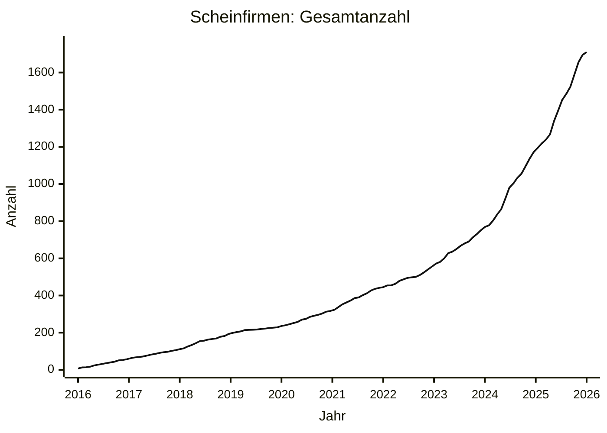

# Scheinfirmen Österreich — Statistik

| Stand | Gesamt | Erster Eintrag |
|-------|-------:|----------------|
| 2026-11-10T10:42:34 | 1710 | 2016-04-01 |

## Verlauf

```mermaid
---
config:
  themeVariables:
    xyChart:
      plotColorPalette: "#111111"
---
xychart-beta
    title "Scheinfirmen: Gesamtanzahl"
    x-axis "Jahr" 2016 --> 2026
    y-axis "Anzahl" 0 --> 1760
    line [7, 13, 14, 17, 24, 28, 32, 36, 40, 44, 51, 53, 57, 63, 67, 69, 72, 77, 82, 86, 91, 95, 97, 102, 106, 111, 116, 126, 134, 144, 155, 157, 163, 166, 169, 178, 182, 193, 199, 203, 207, 214, 215, 216, 217, 220, 222, 225, 227, 229, 236, 240, 246, 252, 258, 270, 274, 285, 291, 296, 303, 313, 317, 323, 338, 353, 363, 373, 386, 390, 402, 412, 427, 436, 441, 445, 454, 455, 463, 479, 487, 495, 498, 500, 510, 524, 540, 556, 572, 581, 600, 628, 636, 650, 667, 680, 690, 712, 730, 751, 769, 778, 803, 836, 864, 920, 980, 1003, 1034, 1056, 1096, 1137, 1172, 1195, 1219, 1239, 1267, 1339, 1395, 1453, 1485, 1523, 1589, 1655, 1695, 1710]
```

## Neueste Scheinfirmen (letzte 30 Tage)

| Name | UID | Anschrift |
|------|-----|-----------|
| ABEVA Handels GmbH | ATU81356523 | 1100 Wien, Hauffgasse 17 |
| ACS Gyula |  | 7503 Großpetersdorf, Raiffeisenplatz 1 |
| ADIPALLY Saikrishna | ATU81206106 | 1110 Wien, Geiselbergstraße 34-36 |
| AMELIS Bau GmbH | ATU68542918 | 1150 Wien, Stutterheimstraße 16-18 |
| All-in Trockenbau GmbH | ATU74567426 | 1010 Wien, Kohlmarkt 8-10 |
| BABIC Petar | ATU83092546 | 1140 Wien, Ameisgasse 36 |
| BAKRO Bertalan | ATU82731947 | 1160 Wien, Hasnerstraße 82/6 |
| BOLLA Lilla | ATU68313611 | 7471 Rechnitz, Herrengasse 24 |
| Bauer Consulting GmbH | ATU65643716 | 8731 Gaal, Puchschachen 50 |
| CHITHIRANANDAN Asviin |  | 1110 Wien, Miltnerweg 23/16/20 |
| DDS TOP KG | ATU80312109 | 1200 Wien, Klosterneuburger Straße 8 |
| GEOMASTER Bohrtechnik GmbH | ATU78577835 | 7000 Eisenstadt, Mattersburger Straße 26/1 |
| GOSHEVA Vaska | ATU81379526 | 1160 Wien, Gablenzgasse 34 |
| GRG Garage GmbH | ATU79238978 | 1100 Wien, Laxenburger Straße 32 |
| Geani GmbH | ATU83019323 | 1230 Wien, Lastenstraße 23/3/3 |
| ILIEV Sasho | ATU82826328 | 1100 Wien, Erlachgasse 137 |
| JAMBOR Gabor | ATU79403316 | 7503 Großpetersdorf, Raiffeisenplatz 1 |
| KESIREDDY Srikanth Reddy | ATU82270249 | 1140 Wien, Hütteldorfer Straße 181 |
| Kulov GmbH | ATU75629205 | 9020 Klagenfurt/Wörthersee, Pischeldorfer Straße 270 |
| LADIC Albert | ATU82656207 | 1200 Wien, Treustraße 34 |
| LAYA Lerchenfeldergürtel 55A Pro GmbH | ATU72368047 | 1160 Wien, Gablenzgasse 14 |
| LAZAR Zsolt | ATU82801746 | 1100 Wien, Knöllgasse 26 |
| LIV Living Concepts GmbH |  | 9500 Villach, Kärntner Straße 8 |
| Lamberts Holding GmbH |  | 1170 Wien, Schulthessgasse 3 |
| MORAVEC Bau GmbH | ATU74596546 | 1230 Wien, Slamastraße 43/3A |
| MYT GmbH | ATU82959657 | 1210 Wien, Hofherr-Schrantz-Gasse 2 |
| NEMETH Levente Gabor | ATU82789939 | 1100 Wien, Rieplstraße 8 |
| PAMIDALA Venkata Sai Teja | ATU82680537 | 1100 Wien, Jagdgasse 36 |
| PETROVS Vitalijs | ATU83199548 | 1100 Wien, Fernkorngasse 36 |
| PREDESCU Ionut-Lucian | ATU81508469 | 6020 Innsbruck, Dr.-Stumpf-Straße 57 |
| Prog Up GmbH | ATU80501645 | 1220 Wien, Schillingstraße 14A |
| Project RK GmbH | ATU75880067 | 1210 Wien, Schillgasse 16 |
| SAMT e.U. | ATU81730548 | 1220 Wien, Haberergasse 5/6 |
| TCI Technical Center for Innovations GmbH | ATU72598824 | 1160 Wien, Hasnerstraße 82 |
| VASILE Ioan-Eugen | ATU81264819 | 1160 Wien, Lerchenfelder Gürtel 33 |